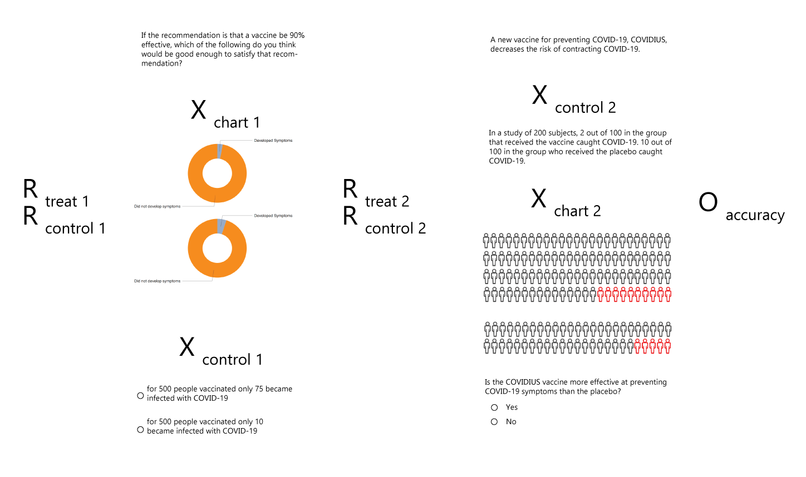
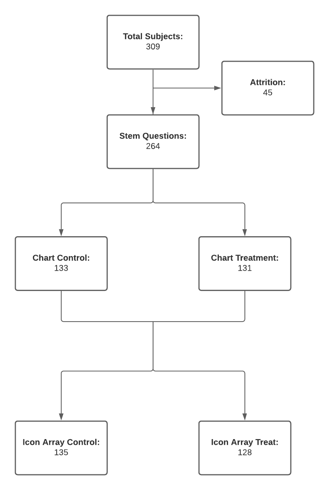

Icons, Charts, Denominators
===========================

### Joshua Noble, Ryan T. Orton, Sandip Panesar

### W241 Spring 2021

Introduction
------------

Reading and understanding ratios, particularly when presented
numerically, can be a taxing task even for people who claim to be at
ease with mathematics **Reference 1**. The entire field of data
visualization has been built around the premise that humans count
objects and see ratios better when presented with graphical
representations of those quantities rather than numerical ones. We
wanted to test whether this was true in a very specific context reading
ratios. Many ratios seem quite easy to read and understand e.g. ½, 25%,
‘2 out of 3’, but many others are more difficult to interpret.
Consequently, it is more difficult to process their context,
particularly when related to probability or efficacy. There are numerous
examples of this effect in everyday life: Millions of people buy lottery
tickets despite the odds; random sampling is foreign enough that
companies still use it as a brain-teaser question in job interviews; and
as we’ve seen in the past six months, vaccine efficacy is rather
difficult to understand.

Study Rationale and Hypothesis
------------------------------

Vaccine efficacy/effectiveness (VE) is measured by calculating the risk
of disease among vaccinated and unvaccinated persons and determining the
percentage reduction in risk of disease among vaccinated persons
relative to unvaccinated persons. The greater the percentage reduction
of illness in the vaccinated group, the greater the vaccine
efficacy/effectiveness. The basic formula is written as:

Risk among unvaccinated group − risk among vaccinated group / Risk among
unvaccinated group

This is how efficacy rates for vaccines are communicated but it’s
unclear exactly how well this is understood. Certainly the COVID-19
pandemic has provided us ample opportunity to witness how these efficacy
results can be confusing.

According to Garcia-Retamero et al **Reference 2**, denominator neglect
is the focus on the number of times a target event has happened
(e.g. the number of treated and nontreated patients who die) without
considering the overall number of opportunities for it to happen
(e.g. the overall number of treated and nontreated patients). In their 2
studies, the authors’ addressed the effect of denominator neglect in
problems involving treatment risk reduction where samples of treated and
non-treated patients and the relative risk reduction were of different
sizes. They also tested whether using icon arrays helped people take
these different sample sizes into account.

Based upon the above, our causal research question is:

**Are icon arrays (or other visual aids) more effective than text-based
numerical ratios for interpretation of numerical ratios?**

We hypothesize, based upon the aforementioned evidence that they are.
More specifically, that a group presented with icon arrays correctly
interprets the numerical ratios presented in them at a greater rate,
compared to a group presented with only text or numbers.

Methods
-------

The original paper on which our study was based examined numerical
ratios and icon arrays. In order to expand the test we wanted to test
both a chart that required interpretation, an icon array which might
require counting, and a numerical ratio which showed a vaccine efficacy.
Our experiment was conducted using the Berkeley XLab to recruit survey
takers.

Research Design
---------------

We adopted an alternative approach to the classical pre-test/post-test
ROXO and instead used a RXRXO post-test control group design. Our survey
did not involve any observation prior to treatment or control
randomization. The subjects were tested via a multi-factorial approach:
All users were first presented with several “stem” questions about the
COVID-19 pandemic and children returning to classrooms. These questions
were the same for all participants and were intended to obscure the
actual purpose of our survey so that participants wouldn’t immediately
think of it as testing ratios or mathematical concepts. Participants
were first presented with a question from the chart treatment stage:
Either a numerical description or a chart. Then the same subject was
presented with a question from the icon array stage: Either a text-based
description or an icon array. Within each stage, subjects would then be
assigned randomly (using Qualtrics’ survey flow randomization algorithm)
into either control or treatment groups (**Figure 1.**):

 **Figure 1** A diagram demonstrating the
overall RXRXO study design.

### Pie Chart Questions

Pie charts are a particularly ineffective form of visualization
**Reference 3**. Our method involved participants differentiating
between pie charts. In information visualization, when presented with
several pie charts, subjects often have difficult interpreting or
differentiating between them **Reference 4**. The pie charts we utilized
lacked numbers and used ratios that were deliberately intended to be
difficult to visually decode: 80%, 90%, 95%, and 97%. In this arm, the
pie chart was either right or wrong, depending upon the ratio presented.
If a pie chart without labels is more effective than a numerical ratio
at expressing efficacy then this provides us with alternative evidence
to test the hypothesis that visual aids were still more effective than
either text or numerical ratios **Figure 2**

 **Figure 2**
a. A pie chart representing 97% efficacy, b. A pie chart representing
85% efficacy.

### Icon Array Questions

For the icon array questions, icon arrays were employed to test
numerical ratios of efficacy against icon arrays that represented
vaccine efficacy. These icon arrays differ from the pie chart pairings
in that they contain countable quantities of different colored icons and
thus can be more precise than the charts **Figure 3**.

<figure>
<figcaption>3a.</figcaption>
</figure>

 **Figure
3** a. Icon array representing the treatment group of a hypothetical
vaccine trial, whereby 4 out of 200 (represented by red and black
figures, respectively) contracted COVID-19 following vaccination. b.
Icon array representing the control group of a hypothetical vaccine
trial, whereby 10 out of 100 (represented by red and black figures,
respectively) contracted COVID-19 following vaccination. Altogether,
vaccine efficacy is 80%.

The ‘correct’ answer to the question presented to the icon array
subjects is also significantly easier to interpret compared to those in
the chart arm. The correct answer was always ‘yes’, i.e. the vaccine was
efficacious at the 80% level.

Confounding Variables
---------------------

In addition to the study-specific data, we also acquired a range of
demographic data of participants. Numerous factors may affect the
responses to our questions, namely how well subjects were able to
understand them. We therefore included self-designated subject age,
English as a second language (ESL) and education level as potential
control variables.

Analytic Plan
-------------

> 1.  Descriptive statistics.
> 2.  Group-based Statistical Tests (Chi-Squared).
> 3.  Regression Analysis with and without potential control features.

Pilot Data
----------

We ran a pilot study using Qualitrics which received 19 valid responses.
This survey was open for approximately 10 days. The structure of the
Pilot survey contained two arms which tested a chart against a
numerator/denominator numerical representation and an icon array against
a numerator/denominator numerical representation. We didn’t collect
demographic data from respondents. The accuracy of responses to the two
questions is shown below:

The pilot study was not large enough to provide reliable sample sizes
but it did provide confirmation that our survey itself was working as
intended.

Results
-------

The overall breakdown of our study is provided in **Figure 4.**. In all
there were 309 respondents. 45 subjects were lost to attrition
(test-stage surveys, failure to complete). For the first question, 131
subjects were presented with the pie-chart (treatment group) and 133
subjects were presented with the text control question. For the second
question, 128 subjects were presented with the icon array (treatment
group), 128 subjects were presented with the text control question.

 **Figure 4.** A diagram demonstrating the
study flow and numbers of respondents for each respective control and
treatment stage.

### Demographics

### Regression Analysis

We created a simple model

  

References
----------

1.  **Insert reference from intro paragraph here**
2.  \[Do Icon Arrays Help Reduce Denominator Neglect?\]
3.  \[(William S. Cleveland, The Elements of Graphing Data, Hobart
    Press, 1994\]
4.  (Edward Tufte, The Visual Display of Quantitative Information,
    Graphics Press, 1983, p. 178.)
