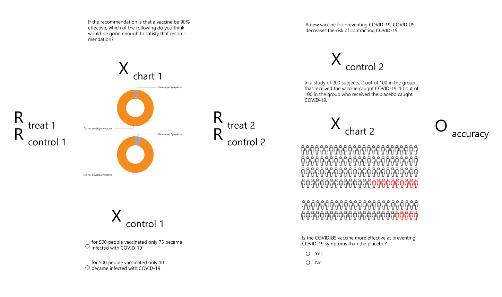
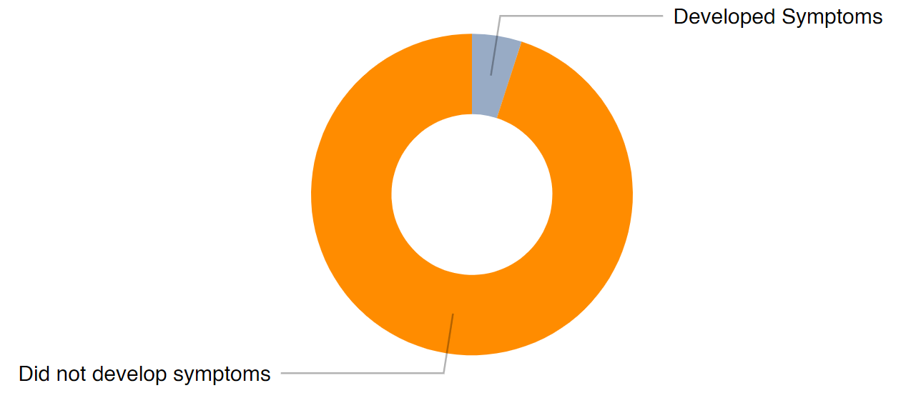
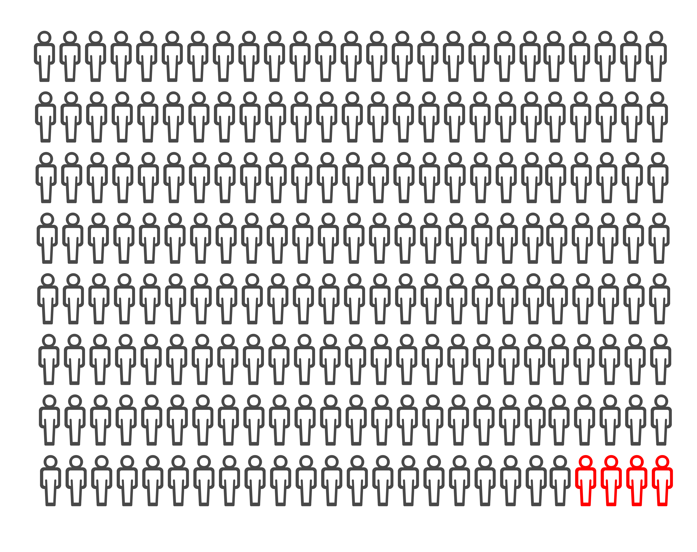
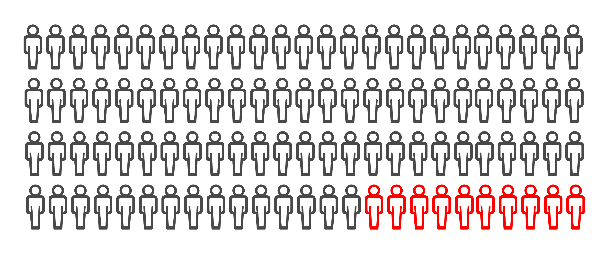

```{r setup, include=FALSE}
knitr::opts_chunk$set(echo = TRUE)
```

# Icons, Charts, Denominators
### Joshua Noble, Ryan T. Orton, Sandip Panesar
### W241 Spring 2021


## Introduction

Reading and understanding ratios, particularly when presented numerically, can be a taxing task even for people who claim to be at ease with mathematics. The entire field of data visualization has been built around the premise that humans count objects and see ratios better when presented with graphical representations of those quantities rather than numerical ones. We wanted to test whether this was true in a very specific context reading ratios. Many ratios seem quite easy to read and understand ½, 25%, ‘2 out of 3’, but many others are more difficult to read and understand and more difficult to process the significance, particularly when that significance represents probability or efficacy. The odds on the lottery don’t dissuade millions of people from buying tickets; random sampling is foreign enough that many companies still have the principles of it as a brain-teaser question in job interviews; and as we’ve seen in the past six months, vaccine efficacy is devilishly difficult to understand. 

Increased emphasis on patient-centered decision making and disease prevention has shifted the responsibility of decision making to patients.

## Background

Vaccine efficacy/effectiveness (VE) is measured by calculating the risk of disease among vaccinated and unvaccinated persons and determining the percentage reduction in risk of disease among vaccinated persons relative to unvaccinated persons. The greater the percentage reduction of illness in the vaccinated group, the greater the vaccine efficacy/effectiveness. The basic formula is written as:

Risk among unvaccinated group − risk among vaccinated group / Risk among unvaccinated group

This is how efficacy rates for vaccines are communicated but it's unclear exactly how well those understood. Certainly the COVID-19 pandemic has provided us ample opportunity to witness how these efficacy results can be confusing.

The impetus for our study comes from a paper titled "Do Icon Arrays Help Reduce Denominator Neglect?" by Rocio Garcia-Retamero, Mirta Galesic, and Gerd Gigerenzer.

"Denominator neglect is the focus on the number of times a target event has happened (e.g., the number of treated and nontreated patients who die) without considering the overall number of opportunities for it to happen (e.g., the overall number of treated and nontreated patients). In 2 studies, we addressed the effect of denominator neglect in problems involving treatment risk reduction where samples of treated and non-treated patients and the relative risk reduction were of different sizes. We also tested whether using icon arrays helps people take these different sample sizes into account."

[Do Icon Arrays Help Reduce Denominator Neglect?]

## Methods

The original paper on which our study was based examined numerical ratios and icon arrays. In order to expand the test we wanted to test both a chart that required interpretation, an icon array which might require counting, and a numerical ratio which showed a vaccine efficacy. 

## Research Design

Our experiment was conducted using the Berkeley XLab to recruit survey takers. Since we had a survey that did not involve any observation before the treatment or control randomization, the study was not a classical pre-test/post-test ROXO but rather a RXRXO Posttest Control Group design. We tested the candidates in a multi-factorial approach. Users were presented with several questions about the COVID-19 pandemic and children returning to classrooms. These questions were the same for all participants and were intended to obscure the actual purpose of our survey so that participants wouldn't immediately think of it as testing ratios or mathematical concepts. Participants were then randomized into a control group which was shown a numerical ratio based question on vaccine efficacy and a  treatment group which was was shown a pie chart visualization which asked about vaccine efficacy.

The study design is shown here:



The rationale for using a pie chart is this: a pie chart is widely regardes as a particularly ineffective form of visualization. "Pie charts [along with other forms of area charts] do not provide efficient detection of geometric objects that convey information about differences of values." [(William S. Cleveland, The Elements of Graphing Data, Hobart Press, 1994]. Worse yet, we asked participants to compare between pie charts. In information visualization, this is famously frowned upon. Edward Tufte, the  “the only worse design than a pie chart is several of them, for then the viewer is asked to compare quantities located in spatial disarray both within and between pies” (Edward Tufte, The Visual Display of Quantitative Information, Graphics Press, 1983, p. 178.) Our pie chart even lacked numbers and use ratios that were slightly more difficult to visually decode: 80%, 90%, 95%, and 97%. If a pie chart without labels is more effective than a numerical ratio at expressing efficacy then this provides us with an interesting test for the inefficacy of numerical ratios. 

{width=50%}
{width=50%}


A second randomization was then employed to test numerical ratios of efficacy against icon arrays that represented vaccine efficacy. These icon arrays differ from the pie chart pairings in that they contain countable quantities of different colored icons and thus can be more precise than the charts. 

{width=50%}

{width=50%}

The 'correct' answer to this second question is also significantly easier, it's always a yes. This allows us to get some visibility into people who may feel intimidated by numbers, e.g. the sentiment that "I'm bad at math" often reported by people which may lead them to skip over information presented numerically or to look for an alternative presentation.


## Analytic Plan

The Berkeley XLab gathered not only answers to our survey but also demographic data. Of particualar interest to our team was the self-designated "ESL" response, which indicated whether the participants was a speaker of English as a second language.