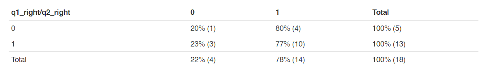
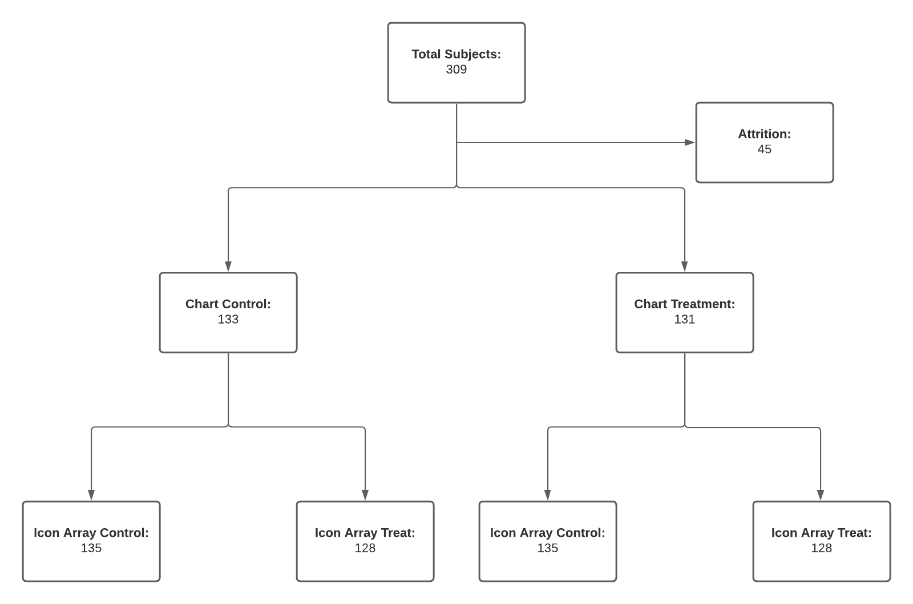
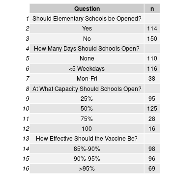
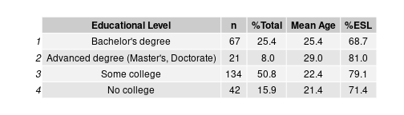
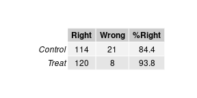

```{r setup, include=FALSE}
knitr::opts_chunk$set(echo = TRUE)
```

# Icons, Charts, Denominators
### Joshua Noble, Ryan T. Orton, Sandip Panesar
### W241 Spring 2021


## Introduction

Reading and understanding ratios, particularly when presented numerically, can be a taxing task even for people who claim to be at ease with mathematics **Reference 1**. The entire field of data visualization has been built around the premise that humans count objects and see ratios better when presented with graphical representations of those quantities rather than numerical ones. We wanted to test whether this was true in a very specific context reading ratios. Many ratios seem quite easy to read and understand e.g. 1/2, 25%, ‘2 out of 3’, but many others are more difficult to interpret. Consequently, it is more difficult to process their context, particularly when related to probability or efficacy. There are numerous examples of this effect in everyday life: Millions of people buy lottery tickets despite the odds; random sampling is foreign enough that companies still use it as a brain-teaser question in job interviews; and as we’ve seen in the past six months, vaccine efficacy is rather difficult to understand.

## Study Rationale and Hypothesis

Vaccine efficacy is measured by calculating the risk of disease among vaccinated and unvaccinated persons and determining the percentage reduction in risk of disease among vaccinated persons relative to unvaccinated persons. The greater the percentage reduction of illness in the vaccinated group, the greater the vaccine efficacy. The basic formula is written as:

$$
\mathrm{Vaccine\ Efficacy\ =\ \frac{Incidence\ among\ unvaccinated\ group\ -\ Incidence\ among\ vaccinated\ group}{Incidence\ among\ unvaccinated\ group}}\times100
$$

It is unclear exactly how well this is understood, however. Certainly the COVID-19 pandemic has provided us ample opportunity to witness how these efficacy results can be confusing.

According to Garcia-Retamero et al **Reference 2**, denominator neglect is the focus on the number of times a target event has happened (e.g. the number of treated and nontreated patients who die) without considering the overall number of opportunities for it to happen (e.g. the overall number of treated and nontreated patients). In their 2 studies, the authors' addressed the effect of denominator neglect in problems involving treatment risk reduction where samples of treated and non-treated patients and the relative risk reduction were of different sizes. They also tested whether using icon arrays helped people take these different sample sizes into account. 

Based upon the above, our causal research question is:

**Are icon arrays (or other visual aids) more effective than text-based numerical ratios for interpretation of numerical ratios?**

We hypothesize, based upon the aforementioned evidence that they are. More specifically, that a group presented with icon arrays correctly interprets the numerical ratios presented in them at a greater rate, compared to a group presented with only text or numbers. The null hypothesis ($h_0$) is that there is no difference in the proportion of correct answers between a group asked to interpret a vaccine efficacy ratio presented in text form and a group asked to interpret a vaccine efficacy ratio presented as an icon array. The alternative hypothesis ($h_1$) is that there is a significantly larger proportion of correct interpretations in the group who are presented with an icon array. 

## Methods

The original paper on which our study was based examined numerical ratios and icon arrays. In order to expand the test we wanted to test both a chart that required interpretation, an icon array which might require counting, and a numerical ratio which showed a vaccine efficacy. Our experiment was conducted using the Berkeley XLab to recruit survey takers.

## Research Design

We adopted an alternative approach to the classical pre-test/post-test ROXO and instead used a RXRXO post-test control group design. Our survey did not involve any observation prior to treatment or control randomization. The subjects were tested via a multi-factorial approach: All users were first presented with several "stem" questions about the COVID-19 pandemic and children returning to classrooms. These questions were the same for all participants and were intended to obscure the actual purpose of our survey so that participants wouldn't immediately think of it as testing ratios or mathematical concepts. Participants were first presented with a question from the chart treatment stage: Either a numerical description or a chart. Then the same subject was presented with a question from the icon array stage: Either a text-based description or an icon array. Within each stage, subjects would then be assigned randomly (using Qualtrics' survey flow randomization algorithm) into either control or treatment groups (**Figure 1.**):


**Figure 1** A diagram demonstrating the overall RXRXO study design.

### Pie Chart Questions

Pie charts are a particularly ineffective form of visualization **Reference 3**. Our method involved participants differentiating between pie charts. In information visualization, when presented with several pie charts, subjects often have difficult interpreting or differentiating between them **Reference 4**. The pie charts we utilized lacked numbers and used ratios that were deliberately intended to be difficult to visually decode: 80%, 90%, 95%, and 97%. In this arm, the pie chart was either right or wrong, depending upon the ratio presented. If a pie chart without labels is more effective than a numerical ratio at expressing efficacy then this provides us with alternative evidence to test the hypothesis that visual aids were still more effective than either text or numerical ratios **Figure 2**

{width=50%}
{width=50%}

**Figure 2** a. A pie chart representing 97% efficacy, b. A pie chart representing 85% efficacy.

### Icon Array Questions

For the icon array questions, icon arrays were employed to test numerical ratios of efficacy against icon arrays that represented vaccine efficacy. These icon arrays differ from the pie chart pairings in that they contain countable quantities of different colored icons and thus can be more precise than the charts **Figure 3**. 

{width=50%}

{width=50%}

**Figure 3** a. Icon array representing the treatment group of a hypothetical vaccine trial, whereby 4 out of 200 (represented by red and black figures, respectively) contracted COVID-19 following vaccination. b. Icon array representing the control group of a hypothetical vaccine trial, whereby 10 out of 100 (represented by red and black figures, respectively) contracted COVID-19 following vaccination. Altogether, vaccine efficacy is 80%.

The 'correct' answer to the question presented to the icon array subjects is also significantly easier to interpret compared to those in the chart arm. The correct answer was always 'yes', i.e. the vaccine was efficacious at the 80% level.

## Confounding Variables

In addition to the study-specific data, we also acquired a range of demographic data of participants. Numerous factors may affect the responses to our questions, namely how well subjects were able to understand them. These include age, level of educational attainment and English as a second language (ESL) status. We therefore kept data from the Berkeley Xlab experimental survey pertaining to these factors for use in analysis. 

## Analytic Plan

> 1. Descriptive statistics.
> 2. Group-based Statistical Tests (Chi-Squared).
> 3. Regression Analysis with and without potential control features. 

## Pilot Data

We ran a pilot study using Qualitrics which received 19 valid responses. This survey was open for approximately 10 days. The structure of the Pilot survey contained two arms which tested a chart against a numerator/denominator numerical representation and an icon array against a numerator/denominator numerical representation. We didn't collect demographic data from respondents. The accuracy of responses to the two questions is shown in **Table 1.**: 



**Table 1.**

The pilot study was not large enough to provide reliable sample sizes but it did provide confirmation that our survey itself was working as intended.

In the chart treatment group, users answered correctly 85.7% of the time, while in the control they answered 83.3% of the time. **Table 2.**.


**Table 2.**

The pilot study was not large enough to provide reliable sample sizes but it did provide confirmation that our survey itself was working as intended.

## Results 

The overall breakdown of our study is provided in **Figure 4.**. In all there were 309 respondents. 45 subjects were lost to attrition (test-stage surveys, failure to complete). For the first question, 131 subjects were presented with the pie-chart (treatment group) and 133 subjects were presented with the text control question. For the second question, 128 subjects were presented with the icon array (treatment group), 128 subjects were presented with the text control question. 



**Figure 4.** A diagram demonstrating the study flow and numbers of respondents for each respective control and treatment stage. 

### Stem Questions

These were asked mainly as a distractor for subjects, prior to being presented with the questions of interest. The results are presented in **Table 3.**

 

**Table 3.**

### Demographics

Regarding relevant demographics, participant age ranged from 18 to 54, with a mean age of 23.5 (standard deviation 5.5). Relevant demographics of the test subjects are presented, grouped by educational level in **Table 4.**.

 

**Table 4.**

Approximately half of the respondents had completed some college (likely undergraduate students), a quarter had completed their undergraduate studies, while only 8% progressed onto further education. 16% of respondents had no college. Interestingly, the majority of respondents in all educational groups were ESL students, with over 4/5 of postgraduate respondents reporting ESL status. 

### Between-Group Comparison

**Table 5.** summarizes the responses received for the first set of questions, where the subjects were exposed to either the text or the pie chart. 83.5% of those in the control answered the question correctly, while only 68.9% in the treatment did. As these data were categorical, consisted of counts between groups, and were generated through random sampling we utilized a $\chi^2$ test to determine if the proportion of right and wrong answers was significantly different between groups. The $\chi^2$ value was 7.42 and had a p-value of 0.006, indicating a highly significant difference. 

 

**Table 4.** 

**Table 5.** summarizes the responses received for the second set of questions, where the subjects were exposed to either the text or the icon array. 84.4% of those in the control answered the question correctly, while 93.8% in the treatment did. As these data were categorical, consisted of counts between groups, and were generated through random sampling we utilized a $\chi^2$ test to determine if the proportion of right and wrong answers was significantly different between groups. The $\chi^2$ value was 5.80 and had a p-value of 0.0160, indicating a significant difference at the 5% level. 



**Table 5.**

To summarize, the treatment arm of the chart control group had a higher proportion of incorrect answers compared to the control arm, while the treatment arm of the icon array group had a higher proportion of correct answers compared to the controls. These differences were significant at the 5% level, confirming our original hypothesis and the cited work concluding that chart data was more difficult to interpret. Nevertheless, the $\chi^2$ hypothesis test cannot control for the additional demographic factors that we identified as potentially being relevant, so further regression analysis may offer further insight by allowing us to control for these factors.  

### Regression Analysis

We created a simple model that regresses the number of correct answers against the participants being in two treatment groups. The responses from chart and array groups were analyzed separately to study for an effect, as even though participants had to answer one question from each group, the randomization process meant that participants could either be presented with control or treatment group questions for either phase. In these models the proportion of all correct answers for each phase (i.e. chart, icon array) was regressed against the proportion of correct answers for the treatment question (**Table 6**). 

\begin{table} \centering 
  \caption{} 
  \label{} 
\begin{tabular}{@{\extracolsep{5pt}}lcccc} 
\\[-1.8ex]\hline 
\hline \\[-1.8ex] 
 & \multicolumn{4}{c}{\textit{Dependent variable:}} \\ 
\cline{2-5} 
\\[-1.8ex] & \multicolumn{2}{c}{q1\_right} & \multicolumn{2}{c}{q2\_right} \\ 
\\[-1.8ex] & (1) & (2) & (3) & (4)\\ 
\hline \\[-1.8ex] 
 q1\_control & 0.209$^{***}$ &  &  &  \\ 
  & (0.053) &  &  &  \\ 
  & & & & \\ 
 q1\_treat &  & $-$0.076 &  &  \\ 
  &  & (0.055) &  &  \\ 
  & & & & \\ 
 q2\_control &  &  & $-$0.086$^{*}$ &  \\ 
  &  &  & (0.039) &  \\ 
  & & & & \\ 
 q2\_treat &  &  &  & 0.099$^{**}$ \\ 
  &  &  &  & (0.038) \\ 
  & & & & \\ 
 Constant & 0.626$^{***}$ & 0.766$^{***}$ & 0.930$^{***}$ & 0.838$^{***}$ \\ 
  & (0.042) & (0.035) & (0.023) & (0.032) \\ 
  & & & & \\ 
\hline \\[-1.8ex] 
Observations & 264 & 264 & 264 & 264 \\ 
R$^{2}$ & 0.055 & 0.007 & 0.018 & 0.024 \\ 
Adjusted R$^{2}$ & 0.052 & 0.004 & 0.015 & 0.021 \\ 
Residual Std. Error (df = 262) & 0.433 & 0.443 & 0.316 & 0.315 \\ 
F Statistic (df = 1; 262) & 15.350$^{***}$ & 1.942 & 4.872$^{*}$ & 6.562$^{*}$ \\ 
\hline 
\hline \\[-1.8ex] 
\textit{Note:}  & \multicolumn{4}{r}{$^{*}$p$<$0.05; $^{**}$p$<$0.01; $^{***}$p$<$0.001} \\ 
\end{tabular} 
\end{table}    

**Table 6.**

**Table 6.** demonstrates the results of the most basic regression models. Here we can see that the coefficient for q1_control is 0.209 (with a robust standard error of 0.053, p<0.05), which is significant. We can see that the coefficient for q1_treat is -0.076 (associated with a robust standard error of 0.055), which is not significant. The coefficient for q2_control is -0.086 (with a robust standard error of 0.039, p<0.05), which is significant. The coefficient for q2_treat is 0.099 (associated with a robust standard error of 0.038), which is significant at the 5% level. These results generally corroborate our results from the previous section, however as the coefficient for q1_treat is not significant (even though it demonstrates a negative relationship, which was previously observed), we cannot draw any conclusions from it. We can say with more confidence, however, that being presented with the control question for the first set of questions was positively associated with getting a correct answer. We can also say that the positive coefficient associated with q2_treat indicates that the icon array is associated with an increase in the proportion of correct answers and getting the text question causes an opposite effect. Nevertheless, there may be other factors associated with the results we have observed, which require further investigation.

The second model based upon the first, but with education level added as a potential control variable, in order to study whether education level could explain any of the variance of the dependent variable (**Table 7.**). We elected to keep this and all subsequent models as additive rather than multiplicative models, as interpretation of a q1_right:variable_z interaction term is difficult whether variable_z is categorical or continuous.

\begin{table}[!htbp] \centering 
  \caption{} 
  \label{} 
\begin{tabular}{@{\extracolsep{5pt}}lcccc} 
\\[-1.8ex]\hline 
\hline \\[-1.8ex] 
 & \multicolumn{4}{c}{\textit{Dependent variable:}} \\ 
\cline{2-5} 
\\[-1.8ex] & \multicolumn{2}{c}{q1\_right} & \multicolumn{2}{c}{q2\_right} \\ 
\\[-1.8ex] & (1) & (2) & (3) & (4)\\ 
\hline \\[-1.8ex] 
 q1\_control & 0.219$^{***}$ &  &  &  \\ 
  & (0.053) &  &  &  \\ 
  & & & & \\ 
 q1\_treat &  & $-$0.087 &  &  \\ 
  &  & (0.055) &  &  \\ 
  & & & & \\ 
 q2\_control &  &  & $-$0.095$^{*}$ &  \\ 
  &  &  & (0.039) &  \\ 
  & & & & \\ 
 q2\_treat &  &  &  & 0.110$^{**}$ \\ 
  &  &  &  & (0.038) \\ 
  & & & & \\ 
 as.factor(Edu\_Level)Bachelor's degree & 0.038 & 0.035 & $-$0.074$^{*}$ & $-$0.072$^{*}$ \\ 
  & (0.114) & (0.120) & (0.034) & (0.033) \\ 
  & & & & \\ 
 as.factor(Edu\_Level)No college & 0.080 & 0.093 & $-$0.202$^{**}$ & $-$0.204$^{**}$ \\ 
  & (0.120) & (0.125) & (0.062) & (0.063) \\ 
  & & & & \\ 
 as.factor(Edu\_Level)Some college & 0.185 & 0.178 & $-$0.135$^{***}$ & $-$0.136$^{***}$ \\ 
  & (0.105) & (0.110) & (0.032) & (0.032) \\ 
  & & & & \\ 
 Constant & 0.504$^{***}$ & 0.656$^{***}$ & 1.054$^{***}$ & 0.953$^{***}$ \\ 
  & (0.105) & (0.106) & (0.025) & (0.020) \\ 
  & & & & \\ 
\hline \\[-1.8ex] 
Observations & 264 & 264 & 264 & 264 \\ 
R$^{2}$ & 0.082 & 0.031 & 0.047 & 0.054 \\ 
Adjusted R$^{2}$ & 0.068 & 0.016 & 0.032 & 0.039 \\ 
Residual Std. Error (df = 259) & 0.429 & 0.441 & 0.313 & 0.312 \\ 
F Statistic (df = 4; 259) & 5.784$^{***}$ & 2.087 & 3.161$^{*}$ & 3.678$^{**}$ \\ 
\hline 
\hline \\[-1.8ex] 
\textit{Note:}  & \multicolumn{4}{r}{$^{*}$p$<$0.05; $^{**}$p$<$0.01; $^{***}$p$<$0.001} \\ 
\end{tabular} 
\end{table} 

**Table 7.**

As we can observe in **Table 7.**, the previously observed relationship between the chart and icon array treatments and getting a respective correct answer for each group is preserved. The coefficient for q1_control is 0.219 (with a robust standard error of 0.053, p<0.05) and the q1_treat coefficient is -0.087 (with a robust standard error of 0.055), which is not significant. The coefficient for q2_control is -0.095 (with a robust standard error of 0.039, p<0.05). The coefficient for q2_treat is 0.110 (with a robust standard error of 0.038) which is now highly significant. For the chart questions, educational levels do not seem to explain any of the variance in the dependent variable. In general, having any level of education is positively associated with getting either control or treatment question 2 correct. Moreover, the negative coefficients associated with the various categories of educated, when subtracted from the baseline (i.e. having an advanced degree, which has the largest positive coefficient effect), all yield coefficients larger than 0, indicating a positive association between all education levels and getting either the control or treatment questions right. All of these are significant at less than 5% significance. Furthermore, the adjusted $R^2$ values have increased for all models, compared to the baseline models (chart control: 0.068 vs. 0.052, chart treatment: 0.016 vs. 0.004, array control: 0.032 vs. 0.015, array treatment: 0.039 vs. 0.021) indicating better fit.


Based upon **Reference ??**, we identified that those of increased age performed worse when tasked with denominator interpretation compared to younger people. We decided to see if our results demonstrated this same phenomenon by including participant age (represented by 'Birthyear') in the regression model. The results are represented in **Table 8.**.

\begin{table} \centering 
  \caption{} 
  \label{} 
\begin{tabular}{@{\extracolsep{5pt}}lcccc} 
\\[-1.8ex]\hline 
\hline \\[-1.8ex] 
 & \multicolumn{4}{c}{\textit{Dependent variable:}} \\ 
\cline{2-5} 
\\[-1.8ex] & \multicolumn{2}{c}{q1\_right} & \multicolumn{2}{c}{q2\_right} \\ 
\\[-1.8ex] & (1) & (2) & (3) & (4)\\ 
\hline \\[-1.8ex] 
 q1\_control & 0.190$^{***}$ &  &  &  \\ 
  & (0.054) &  &  &  \\ 
  & & & & \\ 
 q1\_treat &  & $-$0.077 &  &  \\ 
  &  & (0.055) &  &  \\ 
  & & & & \\ 
 q2\_control &  &  & $-$0.070 &  \\ 
  &  &  & (0.038) &  \\ 
  & & & & \\ 
 q2\_treat &  &  &  & 0.085$^{*}$ \\ 
  &  &  &  & (0.038) \\ 
  & & & & \\ 
 Birthyear & $-$0.005 & $-$0.006 & 0.004 & 0.005 \\ 
  & (0.005) & (0.005) & (0.003) & (0.003) \\ 
  & & & & \\ 
 Constant & 0.755$^{***}$ & 0.908$^{***}$ & 0.827$^{***}$ & 0.747$^{***}$ \\ 
  & (0.122) & (0.124) & (0.072) & (0.074) \\ 
  & & & & \\ 
\hline \\[-1.8ex] 
Observations & 257 & 257 & 257 & 257 \\ 
R$^{2}$ & 0.052 & 0.013 & 0.018 & 0.024 \\ 
Adjusted R$^{2}$ & 0.045 & 0.005 & 0.011 & 0.017 \\ 
Residual Std. Error (df = 254) & 0.428 & 0.437 & 0.306 & 0.305 \\ 
F Statistic (df = 2; 254) & 6.967$^{**}$ & 1.627 & 2.372 & 3.158$^{*}$ \\ 
\hline 
\hline \\[-1.8ex] 
\textit{Note:}  & \multicolumn{4}{r}{$^{*}$p$<$0.05; $^{**}$p$<$0.01; $^{***}$p$<$0.001} \\ 
\end{tabular} 
\end{table} 

**Table 8.**

In this model, for question 1, the coefficient for q1_control is 0.190 (with a robust standard error of 0.054, p<0.05) and that for q1_treat is -0.77 (with a robust standard error of 0.055, non-significant). The coefficient for q2_control is -0.70 (associated with a robust standard error of 0.038, non-significant) while that for q2_treat is 0.085 (robust standard error of 0.038, p<0.05). We can also see that all of the coefficients representing age are associated with relatively large robust standard errors, and non-significant. Furthermore, the adjusted $R^2$ values has decreased for all models aside from the chart treatment, compared to the baseline models (chart control: 0.045 vs. 0.052, chart treatment: 0.005 vs. 0.004, array control: 0.011 vs. 0.015, array treatment: 0.017 vs. 0.021) indicating worse goodness-of-fit relative to the simple models. Altogether we can interpret that age did not have a substantial effect on performance in either phase of our study.

Students who are ESL may find reading English difficult, especially if the language is technical. As such, ESL students may naturally perform better on visual interpretations compared with interpreting text. We therefore decided to include whether the student was ESL in our regression model to see if it accounted for any of the variation in the dependent variable (**Table 9.**). 

\begin{table} \centering 
  \caption{} 
  \label{} 
\begin{tabular}{@{\extracolsep{5pt}}lcccc} 
\\[-1.8ex]\hline 
\hline \\[-1.8ex] 
 & \multicolumn{4}{c}{\textit{Dependent variable:}} \\ 
\cline{2-5} 
\\[-1.8ex] & \multicolumn{2}{c}{q1\_right} & \multicolumn{2}{c}{q2\_right} \\ 
\\[-1.8ex] & (1) & (2) & (3) & (4)\\ 
\hline \\[-1.8ex] 
 q1\_control & 0.208$^{***}$ &  &  &  \\ 
  & (0.054) &  &  &  \\ 
  & & & & \\ 
 q1\_treat &  & $-$0.075 &  &  \\ 
  &  & (0.056) &  &  \\ 
  & & & & \\ 
 q2\_control &  &  & $-$0.086$^{*}$ &  \\ 
  &  &  & (0.038) &  \\ 
  & & & & \\ 
 q2\_treat &  &  &  & 0.099$^{**}$ \\ 
  &  &  &  & (0.038) \\ 
  & & & & \\ 
 as.factor(ESL == "Yes") & 0.011 & 0.025 & 0.009 & 0.009 \\ 
  & (0.063) & (0.065) & (0.046) & (0.045) \\ 
  & & & & \\ 
 Constant & 0.618$^{***}$ & 0.746$^{***}$ & 0.923$^{***}$ & 0.831$^{***}$ \\ 
  & (0.062) & (0.063) & (0.039) & (0.048) \\ 
  & & & & \\ 
\hline \\[-1.8ex] 
Observations & 264 & 264 & 264 & 264 \\ 
R$^{2}$ & 0.055 & 0.008 & 0.018 & 0.025 \\ 
Adjusted R$^{2}$ & 0.048 & 0.0004 & 0.011 & 0.017 \\ 
Residual Std. Error (df = 261) & 0.433 & 0.444 & 0.316 & 0.315 \\ 
F Statistic (df = 2; 261) & 7.662$^{***}$ & 1.047 & 2.449 & 3.291$^{*}$ \\ 
\hline 
\hline \\[-1.8ex] 
\textit{Note:}  & \multicolumn{4}{r}{$^{*}$p$<$0.05; $^{**}$p$<$0.01; $^{***}$p$<$0.001} \\ 
\end{tabular} 
\end{table} 

**Table 9.**

We can see from **Table 9.** that the general relationship between the proportion correct in the control and treatment groups and the overall proportion correct is preserved. The coefficient for q1_control is 0.208 (with a robust standard error of 0.054, p<0.05) and the coefficient for q1_treat is -0.075 (with a robust standard error of 0.056, not-significant). The coefficient for q2_control is -0.086* (with a robust standard error of 0.038, p<0.05) and for q2_treat, it is 0.099 (with a robust standard error of 0.038), which is significant at the 5% level. Our model indicates that ESL status does not contribute to getting questions right for any of the models, with all coefficients being associated with relatively large robust standard errors, rendering them non-significant at the 5% level. From this we can interpret that ESL status did not explain any of the variance in getting any of the control or treatment questions right in our model. This is corroborated by worse adjusted $R^2$ values compared to the simple model (chart control: 0.048 vs. 0.052, chart treatment:0.0004 vs. 0.004, array control: 0.011 vs. 0.015, array treatment: 0.017 vs. 0.021). 

In summary, aside from the effect of various educational levels on getting the second set of questions correct, none of these identified variables substantially explained for variance of the dependent variable. Consequently, a "fully saturated" model consisting of all additional variables in addition to our variable of interest (either q1_treat or q2_treat) is not necessary. 

## Discussion

We conducted a randomized experiment whereby participants were asked to answer two questions successively pertaining to vaccine efficacy. They were either presented with control or treatment questions for each stage. Participants performed significantly better when interpreting vaccine efficacy ratios presented as icon arrays, relative to text-based ratios. We can therefore reject the null hypothesis in favour of the alternative hypothesis if we use the results from our first between-group comparison (using $\chi^2$ tests of significance). Our regression results from the second phase of the experiment corroborate this. We cannot conclude, based upon regression results from the first phase of the study (i.e. pie charts) that pie charts are worse than text-based numeric ratios, however. In general, in all of the models, the coefficients associated with the pie-chart treatment were negative (though non-significant), indicating that there may potentially be a negative relationship between being exposed to pie charts and getting a correct answer which our initial analysis suggests. The lack of significance of the regression coefficient for the pie chart treatment question might reflect a genuine lack of relationship, or perhaps a too-small sample size. Nevertheless, our main postulation still holds. 

The only considered control variable that partially accounted for variability in the proportion of right answers was educational level. This only exerted a significant effect on the results for the icon array phase of the study, however unpacking this interpretation is difficult. For example, it is to be expected that having any level of post-secondary education might mean that one has been exposed to the tested concepts. Nevertheless, even having "no college" was associated with getting any of the treat or control icon array questions correct. This might be attributable to Xlab participants being perhaps more educated, despite not having a formal college education, or perhaps students that have not completed their undergraduate studies selecting "no college", thinking that this best described them. The fact that a majority of all groups were ESL students may have played a role in this, as interpretation of "no college" may be taken literally by some to mean they are in college, but haven't yet graduated, for example. Moreover, the fact that educational levels exerted an effect on getting questions right for the icon array questions but not the pie chart questions might reflect on the nature of the questions themselves. The questions were of a different format for the pie chart phase: Instead of being asked to select if a vaccine was efficacious (i.e. a yes/no answer) after being presented ratios of positive cases in placebo and treatment groups, the pie chart arm involved the participant being asked a different format question (see **Figure 1.**). Subsequently, it might have been confusing for participants regardless of educational level (and also taking into account many were ESL).

Age did not explain any of the variance in interpretation of either picture or text-based numerical ratios. The study by **reference?** found that older people were more likely to demonstrate denominator neglect. Our results do not demonstrate this, but this could be because the overall mean participant age was early-20s, and no group had a mean age <30. Therefore the sample of participants was not representative of a group that would be expected to demonstrate denominator neglect. Similarly, we did not find that ESL was significantly associated with getting either treatment or control questions correct. We might expect that ESL students would have a harder time interpreting text written in English. The lack of association might be explained by the fact that the majority of Xlab participants are in some way affiliated with UC Berkeley, an elite institute of higher education. Consequently, their English level might be good enough to negate any potential effect that ESL might have if we conducted this experiment in a different population. 

In general, the fact that participants were recruited through Xlab might however account for the numbers that we have observed, and any associated data patterns. These effects may not be preserved if the experiment was conducted in a different population.

##Conclusions

We have successfully demonstrated that icon arrays are beneficial at helping people to interpret numerical ratios, and confirmed our initial postulation. Icon arrays may also be better than pie charts, however we cannot say this with as great a degree of confidence. More work is needed to further confirm this postulation, as it may potentially be beneficial in educating the public about important concepts such as vaccine efficacy. 

## References

1. 
2. [Do Icon Arrays Help Reduce Denominator Neglect?]
3. [(William S. Cleveland, The Elements of Graphing Data, Hobart Press, 1994]
4. (Edward Tufte, The Visual Display of Quantitative Information, Graphics Press, 1983, p. 178.)

