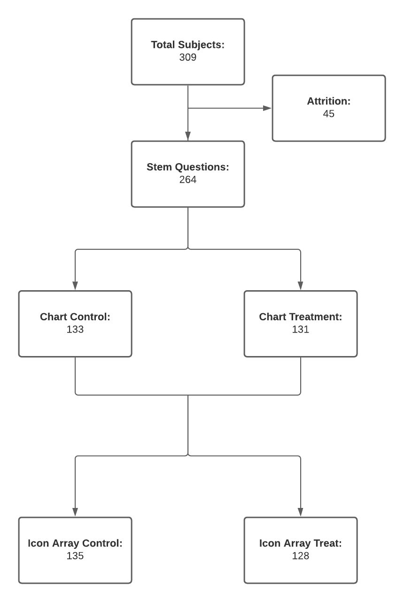

```{r setup, include=FALSE}
knitr::opts_chunk$set(echo = TRUE)
```

# Icons, Charts, Denominators
### Joshua Noble, Ryan T. Orton, Sandip Panesar
### W241 Spring 2021


## Introduction

Reading and understanding ratios, particularly when presented numerically, can be a taxing task even for people who claim to be at ease with mathematics **Reference 1**. The entire field of data visualization has been built around the premise that humans count objects and see ratios better when presented with graphical representations of those quantities rather than numerical ones. We wanted to test whether this was true in a very specific context reading ratios. Many ratios seem quite easy to read and understand e.g. ½, 25%, ‘2 out of 3’, but many others are more difficult to interpret. Consequently, it is more difficult to process their context, particularly when related to probability or efficacy. There are numerous examples of this effect in everyday life: Millions of people buy lottery tickets despite the odds; random sampling is foreign enough that companies still use it as a brain-teaser question in job interviews; and as we’ve seen in the past six months, vaccine efficacy is rather difficult to understand.

## Study Rationale and Hypothesis

Vaccine efficacy/effectiveness (VE) is measured by calculating the risk of disease among vaccinated and unvaccinated persons and determining the percentage reduction in risk of disease among vaccinated persons relative to unvaccinated persons. The greater the percentage reduction of illness in the vaccinated group, the greater the vaccine efficacy/effectiveness. The basic formula is written as:

Risk among unvaccinated group − risk among vaccinated group / Risk among unvaccinated group

This is how efficacy rates for vaccines are communicated but it's unclear exactly how well this is understood. Certainly the COVID-19 pandemic has provided us ample opportunity to witness how these efficacy results can be confusing.

According to Garcia-Retamero et al **Reference 2**, denominator neglect is the focus on the number of times a target event has happened (e.g. the number of treated and nontreated patients who die) without considering the overall number of opportunities for it to happen (e.g. the overall number of treated and nontreated patients). In their 2 studies, the authors' addressed the effect of denominator neglect in problems involving treatment risk reduction where samples of treated and non-treated patients and the relative risk reduction were of different sizes. They also tested whether using icon arrays helped people take these different sample sizes into account. 

Based upon the above, our causal research question is:

**Are icon arrays (or other visual aids) more effective than text-based numerical ratios for interpretation of numerical ratios?**

We hypothesize, based upon the aforementioned evidence that they are. More specifically, that a group presented with icon arrays correctly interprets the numerical ratios presented in them at a greater rate, compared to a group presented with only text or numbers.

## Methods

The original paper on which our study was based examined numerical ratios and icon arrays. In order to expand the test we wanted to test both a chart that required interpretation, an icon array which might require counting, and a numerical ratio which showed a vaccine efficacy. Our experiment was conducted using the Berkeley XLab to recruit survey takers.


## Research Design

We adopted an alternative approach to the classical pre-test/post-test ROXO and instead used a RXRXO post-test control group design. Our survey did not involve any observation prior to treatment or control randomization. The subjects were tested via a multi-factorial approach: All users were first presented with several "stem" questions about the COVID-19 pandemic and children returning to classrooms. These questions were the same for all participants and were intended to obscure the actual purpose of our survey so that participants wouldn't immediately think of it as testing ratios or mathematical concepts. Participants were first presented with a question from the chart treatment stage: Either a numerical description or a chart. Then the same subject was presented with a question from the icon array stage: Either a text-based description or an icon array. Within each stage, subjects would then be assigned randomly (using Qualtrics' survey flow randomization algorithm) into either control or treatment groups (**Figure 1.**):


**Figure 1** A diagram demonstrating the overall RXRXO study design.

### Pie Chart Questions

Pie charts are a particularly ineffective form of visualization **Reference 3**. Our method involved participants differentiating between pie charts. In information visualization, when presented with several pie charts, subjects often have difficult interpreting or differentiating between them **Reference 4**. The pie charts we utilized lacked numbers and used ratios that were deliberately intended to be difficult to visually decode: 80%, 90%, 95%, and 97%. In this arm, the pie chart was either right or wrong, depending upon the ratio presented. If a pie chart without labels is more effective than a numerical ratio at expressing efficacy then this provides us with alternative evidence to test the hypothesis that visual aids were still more effective than either text or numerical ratios **Figure 2**

{width=50%}
{width=50%}
**Figure 2** a. A pie chart representing 97% efficacy, b. A pie chart representing 85% efficacy.

### Icon Array Questions

For the icon array questions, icon arrays were employed to test numerical ratios of efficacy against icon arrays that represented vaccine efficacy. These icon arrays differ from the pie chart pairings in that they contain countable quantities of different colored icons and thus can be more precise than the charts **Figure 3**. 

{width=50%}

{width=50%}
**Figure 3** a. Icon array representing the treatment group of a hypothetical vaccine trial, whereby 4 out of 200 (represented by red and black figures, respectively) contracted COVID-19 following vaccination. b. Icon array representing the control group of a hypothetical vaccine trial, whereby 10 out of 100 (represented by red and black figures, respectively) contracted COVID-19 following vaccination. Altogether, vaccine efficacy is 80%.

The 'correct' answer to the question presented to the icon array subjects is also significantly easier to interpret compared to those in the chart arm. The correct answer was always 'yes', i.e. the vaccine was efficacious at the 80% level. This permitted insight into whether people may have felt intimidated by numbers, e.g. confirming the sentiment of "I'm bad at math" which is often reported among lay subjects.

## Confounding Variables

In addition to the study-specific data, we also acquired a range of demographic data of participants. Numerous factors may affect the responses to our questions, namely how well subjects were able to understand them. We therefore included self-designated subject age, English as a second language (ESL) and education level as potential control variables. 

## Analytic Plan

> 1. Descriptive statistics.
> 2. Group-based Statistical Tests (Chi-Squared).
> 3. Regression Analysis with and without potential control features. 

## Pilot Data

We ran a pilot study using Qualitrics which received 19 valid responses. We'll load and analyze our Pilot Data:

```{r}
pilot <- fread("pilot_data.csv")

pilot[,q1_right := ifelse((Chart_Control1 == 'Right' | Chart_Control2 == 'Right' | Chart_Treat1 == 'Right' | Chart_Treat2 == 'Right'), 1, 0) ]
pilot[,q1_treat := ifelse( (Chart_Treat1 != "" | Chart_Treat2 != ""), 1, 0) ]
pilot[,q2_right := ifelse(Array_Control1 == 'Right' | Array_Control2 == 'Right' | Array_Control3 == 'Right' | Array_Treat1 == 'Right' | Array_Treat2 == 'Right' | Array_Treat3 == 'Right', 1, 0) ]
pilot[,q2_treat := ifelse( Array_Treat2  != "" | Array_Treat1  != "" | Array_Treat3 != "", 1, 0) ]
pilot[,all_q_right := q1_right + q2_right ]

tabyl(pilot, q1_right, q2_right)
```

We can assess the users accuracy with each treatment by evaluating how often they correctly answered  the questions in the pilot:

```{r}
p_chart_treat_right <- nrow(pilot[q1_right == 1 & q1_treat == 1,]) / nrow(pilot[q1_treat == 1,]) 
p_chart_control_right <- nrow(pilot[q1_right == 1 & q1_treat == 0,]) / nrow(pilot[q1_treat == 0,]) 
```

In the chart treatment group, users answered correctly `r p_chart_treat_right`% of the time, while in the control they answered `r p_chart_control_right`.


```{r}
p_array_treat_right <- nrow(pilot[q2_right == 1 & q2_treat == 1,]) / nrow(pilot[q2_treat == 1,])
p_array_control_right <- nrow(pilot[q2_right == 1 & q2_treat == 0,]) / nrow(pilot[q2_treat == 0,])

p_array_treat_right
p_array_control_right
```

In the chart treatment group, users answered correctly `r p_array_treat_right`% of the time, while in the control they answered `r p_array_control_right`.

The pilot study was not large enough to provide reliable sample sizes but it did provide confirmation that our survey itself was working as intended.

## Results 

The overall breakdown of our study is provided in **Figure 4.**. In all there were 309 respondents. 45 subjects were lost to attrition (test-stage surveys, failure to complete). For the first question, 131 subjects were presented with the pie-chart (treatment group) and 133 subjects were presented with the text control question. For the second question, 128 subjects were presented with the icon array (treatment group), 128 subjects were presented with the text control question. 


**Figure 4.** A diagram demonstrating the study flow and numbers of respondents for each respective control and treatment stage. 

### Demographics

Regarding relevant demographics, participant age ranged from 18 to 54, with a mean age of 23.5 (standard deviation 5.5). Relevant demographics of the test subjects are presented, grouped by educational level in **Table 1.**.

 

Approximately half of the respondents had completed some college (likely undergraduate students), a quarter had completed their undergraduate studies, while only 8% progressed onto further education. 16% of respondents had no college. Interestingly, the majority of respondents in all educational groups were ESL students, with almost 4/5 of postgraduate respondents reporting ESL status. 


## References

1. **Insert reference from intro paragraph here**
2. [Do Icon Arrays Help Reduce Denominator Neglect?]
3. [(William S. Cleveland, The Elements of Graphing Data, Hobart Press, 1994]
4. (Edward Tufte, The Visual Display of Quantitative Information, Graphics Press, 1983, p. 178.)

